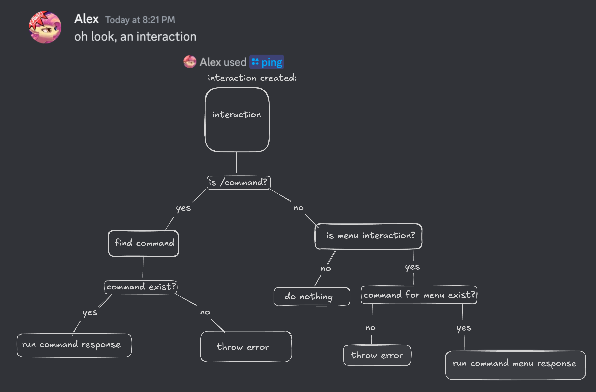

# Discord Bot //
## Built with

## Why am I building this?
I'm using this project to learn how to make a discord bot with different functionalities.
> ### What I hope to learn:
> - A bit of how discord works under the hood
> - How to use Discords API through the use of [discord.js](https://discord.js.org/)
## Current flow for handling interactions //
### Commands / Menu interactions

## Features to add
### Minecraft server integration
> I want to be able to display events happening on a minecraft server on a discord server / on a webpage
> #### Needs
> - Discord server ✔️
> - Node server ✔️
> - Minecraft server ✔️
> - Plugin for event listening on server(WIP) ✔️
> - Communicate the right data between servers
> - Display data with bot
>   
> Tools I need to implement to achieve this:
> 
> 
